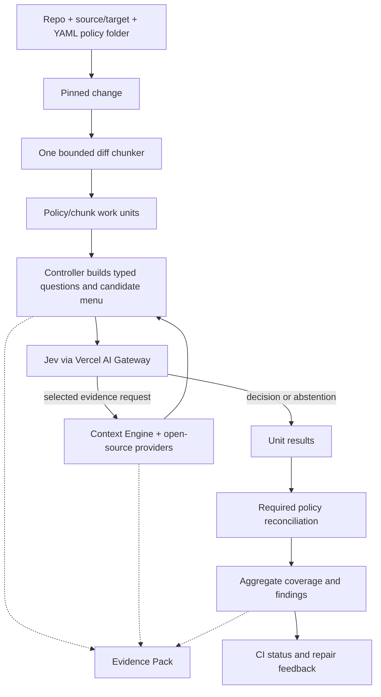

# Architecture

Status: design revision 0.2. `jev-ci` is the controller/CLI; TypeSafe Jev is the typed evaluation model reached through Vercel AI Gateway.

| Component | Owns | Must not own |
| --- | --- | --- |
| CLI/coordinator | Inputs, unit scheduling, budgets, durable output | CI-vendor authentication or unbounded retries |
| Git adapter | Pinned changes and snapshots | Policy judgment or implicit fetching |
| Diff chunker | All segmentation, chunk caps, IDs, continuations | Language parsing or semantic grouping |
| YAML policy loader | Safe parsing, schema/document validation, frozen pack | Candidate-controlled CI authority |
| Protocol controller | Typed questions, score checks, transitions, abstention | Free-form generated tool execution |
| Request candidate builder | Bounded concrete requests from facts and authored terms | Policy decisions |
| Gateway adapter | Native Jev HTTP contract, response validation, telemetry | Policy meaning or model fallback |
| Context Engine/providers | Authorized facts, provenance, cache, limitations | Code edits or compliance verdicts |
| Aggregator | Unit/reconciliation coverage, findings, conflict records | Averaging scores into branch confidence |
| Trace store/CI mapper | Replayable records and trusted enforcement | Hiding partial runs or treating green as proof |

Proposed package modules: `cli`, `git`, `diff_chunking`, `policy`, `protocol`, `request_candidates`, `context`, `providers`, `inference`, `aggregation`, `trace`, and `ci`. These are boundaries in one package, not separate services. Use maintained YAML/JSON/schema/HTTP libraries. Provider output parsing is allowed; language grammar/semantic resolution stays in existing tools.

The public [chunking contract](diff-chunking.md) isolates future strategy changes. Every policy/chunk or reconciliation unit has an isolated state; policy outcomes cannot contaminate other policies. Reconciliation sees only its own prior outcomes and grounded evidence and may request originals. Execute sequentially initially, in recorded chunk/policy order. Immutable provider caches can be shared; record cache hits and cold/warm preparation cost.

Trusted root config selects pinned providers and supplies the YAML folder/document bindings. Candidate source, comments, filenames, and documents are evidence. The controller maps Jev's choice IDs to previously constructed, validated request objects. All candidate menus, rejected choices, support selections, and normalization decisions are recorded. Native typed answers do not contain authored repair prose; messages come from the policy's feedback templates and actual excerpt locations.

Read committed Git objects or bounded snapshots; never implicitly run project hooks/builds/tests. Optional compiler/LSP indexing that needs a project build belongs in an isolated preparatory job with explicit inputs/resources and no deployment credentials. Use fixed executables and argument arrays, bounded output/deadlines, and no symlinks escaping the authorized snapshot. Runtime Gateway credentials come from a secret environment variable or explicit local dotenv file and never enter model state or trace headers.

The tool remains independent of language, architectural style, CI platform, and coding agent. Additional inference/provider adapters can be added through the same interfaces. A future generative discovery assistant would propose locations only and require a separately versioned/validated treatment; it is not in v0. The application-specific example policies are optional files, outside the core.
